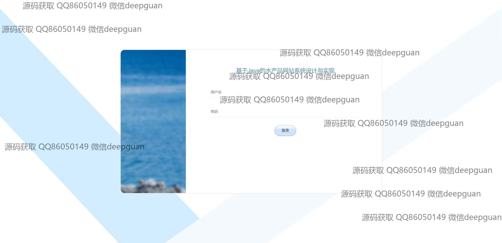

<h1 align="center">基于Java的水产品网站系统设计与实现</h1>

## 简介
基于SSM框架的水产品网站系统，分为管理员和用户角色。用户可浏览商品、管理购物车、进行订单操作、注册登录、充值、管理个人信息；管理员可管理商品、订单、用户、分类、系统设置等功能。    --计算机毕业设计源码；毕设源码；java毕业设计源码

## 联系方式

<h3 align="center">获取完整代码与数据库文件 + 微信：deepguan QQ: 86050149 QQ群: 783742310</h3>

<h3 align="center">可帮忙远程部署 包运行成功！提供远程部署、修改代码、设计文档指导、代码讲解等服务！</h3>

## 功能介绍（完整见运行截图）
管理员：主要负责系统管理与维护，包括用户管理、水产分类与商品管理、订单管理和系统设置。可编辑水产类别和商品详情，上传或修改主页轮播图片。具备用户信息查看与操作权限，可处理用户的注册与登录问题。同时支持在线客服管理，提供实时沟通功能。

用户：用户能够注册、登录和管理个人信息，如修改用户名、密码、地址等。可以浏览网站首页、查看推荐水产品、搜索商品以及查看商品详情。用户可将商品加入购物车、进行购买，以及管理订单状态，包括查看未支付和已支付订单，还可进行退货、确认收货和评价。用户中心提供订单查询、地址管理与收藏功能，并支持与客服进行实时交流。

系统：整体设计提供简洁友好的用户体验，拥有导航栏便利地访问首页、公告信息、购物车和客服中心等，商品页面显示详细信息与促销活动，并允许用户调整购买数量或收藏商品。评论区支持用户互动与反馈，系统背景设计体现水产品主题。提供充值功能，通过多种支付方式完成支付。

客服：在线客服系统为用户提供全天候支持，通过聊天窗口实现与用户的实时交流。支持文本消息发送和文件传输，帮助用户解答各类问题，提升用户体验。客服能够查看用户订单及问题反馈，及时进行信息处理与服务优化。

## 运行截图

本代码来源于网络,仅供学习参考使用!

